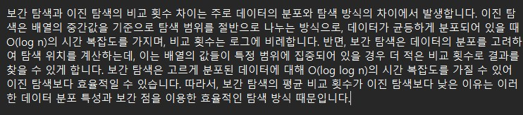
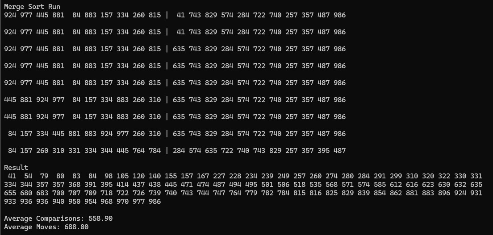
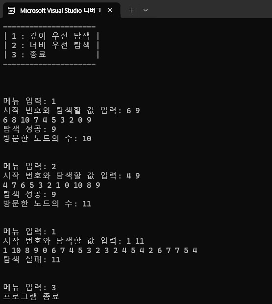

# 17-compareAVL {설명}

# 17-compareAVL {Result Image}

# 16-interpolationSearch {설명}

# 16-interpolationSearch {Result Image}

# 15-compareSearches {성능 비교 설명}

# 15-compareSearches {Result Image}

# 14-quicksort {성능 비교}

# 14-quicksort {Result Image}

# 13-mergesort {Result Image}

# 12-shellsort {Result Image}

# 11-sort {Result Image}

# 10-dijkstra_bonus {Result Image}

# 10-dijkstra_bonus {MinHeap Code Image}

# 9-primmst {Result Image}

# 8-findmst {Result Image}

# 7-dfsbfs {Result Image}

#  6-sortbyheap {Result Image}

# 6-huffman {Result Image}

# 5-maxheaptree {Result Image}

