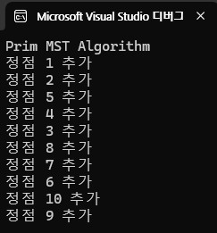

# 11-sort {Result Image}

# 10-dijkstra_bonus {Result Image}

# 10-dijkstra_bonus {MinHeap Code Image}

# 9-primmst {Result Image}

# 8-findmst {Result Image}

# 7-dfsbfs {Result Image}

#  6-sortbyheap {Result Image}

# 6-huffman {Result Image}

# 5-maxheaptree {Result Image}

